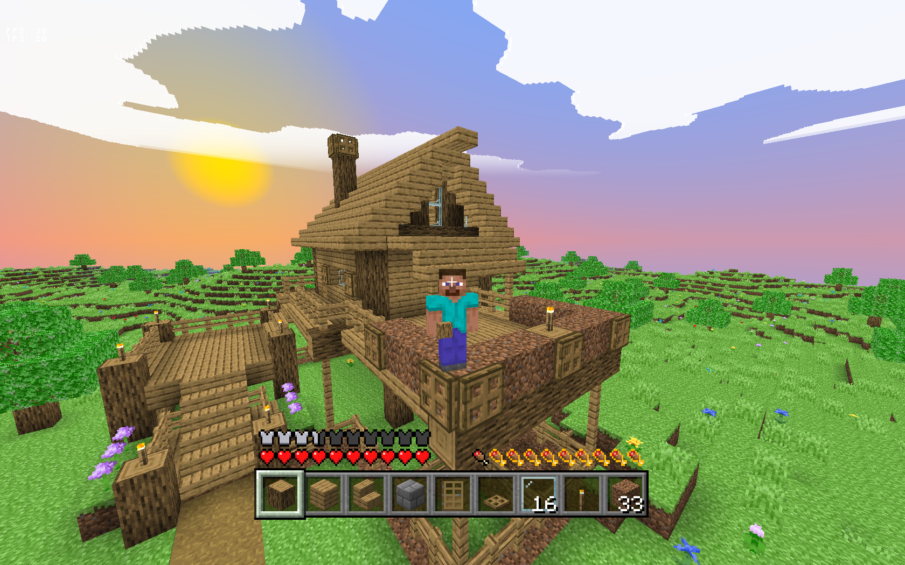

# VOX
My first procedural world. Using OpenGL and C++


## Building
```
$ git clone --recurse-submodules git@github.com:GitHuberlandYann/VOX.git
$ cd VOX
$ make setup
$ make -j
$ make log
```
make setup takes a while as it installs the needed [static libraries](#libraries), but you only need to do it once.

## Goal
Recreate [Minecraft](https://www.minecraft.net). That's it.
I've tackled this project during my formation at [19](https://campus19.be/).
>Minecraft is a 3D sandbox game developed by Mojang Studios where players interact with a fully modifiable three-dimensional environment made of blocks and entities. Its diverse gameplay lets players choose the way they play, allowing for countless possibilities.

## Features
```
Infinite, procedurally generated world
Saving and loading worlds in .json files
Collision and physics systems
Multithreading generation for smooth rendering
Day/Night cycle
Skybox with atmosphere, sunsets, astral bodies
Hunger system
Farming simulation
First and third person point of vue
Different gamemodes
Chat interface with own commands
Transparent blocks, sorted from back to front before being displayed
3D clouds
Tickrate of 20 ticks per second
Block tick: every gametick, a bunch of blocks are selected to be updated, this is used to grow crops, spread grass, remove floating leaves
Entities such as dropped items, flying arrows, falling blocks
2D sprites extruded in 3D to form tools
Particles system, for explosions, smokes, breaking animation
Lighting system, combining light emiting blocks -such as torches- and sky light
Animated fluids flow
Breaking animation
Ambiant occlusion, smooth lighting
Distance fog
Gravity-affected blocks (sand, gravel, lit tnts)
UI for inventory and ingame menus
Crafting system, storage system

And a lot more! All done in C++
```

## Images
Old version of the project, with inventory's items still being 2D sprite, falling water coming from a source in the wall, some lighting in a dirt cave.


More recent screenshot from the game, taken after having some fun with explosives. 


Fluid flowing down a hill.


Night time. Torches on the walls. Items dropped as 3D entities on the ground.


Falling sand. While using a custom data pack.


And of course, Minecraft wouldn't be Minecraft without.. DIAMONDS!


## Shaders
OpenGL uses shaders, which are programs coded in glsl and running on the GPU.
* default - used for all blocks and flowers, x[0:255] y[0:255]
* sky - used for sorted transparent blocks (clouds and water and glass), uses animated sprites
* ui - draws rectangles from given screen coord and sizes
* text - draws character using given screen coord
* item - used to draw 3d items in inventory, x[0:255] y[0:255]
* particle - used to draw particles and models, x[0:255] y[0:255]
* skybox - used to draw cubic skybox around player, with sun, moon, and atmosphere

## Sound engine
Not implemented yet, as I am mainly working on this project on WSL, which [does not support sound](https://github.com/microsoft/WSL/issues/237).

## Controls (Qwerty)
```
escape             - open pause menu, close any open menu
backspace          - exit program

WSAD               - player movement
left_control       - run
left_shift         - sneak
space              - jump
mouse / arrows     - camera movement

Q                  - drop selected item
E                  - open inventory
T                  - open chat
G                  - toggle gamemode
F                  - toggle wireframe display (warning fps may drop)
O                  - toggle block highlight
F1                 - display/hide hotbar
F2                 - save screenshot under .ppm file format
F3                 - toggle debug screen
F5                 - change camera placement

left_click         - break block, pick block in inventory, navigate through menus
right_click        - place block, use item, put block in inventory
middle_click       - sample targeted block in gamemode creative
scoll / 1234656789 - scrolls through hotbar

[]                 - change daycycle speed
kp_+ kp_-          - change player speed in gamemode creative
```


## Libraries
* [GLFW](https://github.com/glfw/glfw.git) is an Open Source, multi-platform library for OpenGL, OpenGL ES and Vulkan application development. It provides a simple, platform-independent API for creating windows, contexts and surfaces, reading input, handling events, etc.
* [GLEW](https://github.com/nigels-com/glew.git) provides efficient run-time mechanisms for determining which OpenGL extensions are supported on the target platform.
* [GLM](https://github.com/g-truc/glm.git) is a header only C++ mathematics library for graphics software based on the OpenGL Shading Language (GLSL) specifications.
* [SOIL](https://github.com/littlstar/soil.git) is a tiny C library used primarily for uploading textures into OpenGL.
* [siv::PerlinNoise](https://github.com/Reputeless/PerlinNoise.git) is a header-only Perlin noise library for modern C++ (C++17/20). The implementation is based on Ken Perlin's Improved Noise.

## References
* The assets used in this project come from https://mcasset.cloud.
* I coded a lot of the game's logic by using technical informations from the [minecraft wiki](https://minecraft.fandom.com/wiki/Minecraft_Wiki).
* [Voxel Traversal Algorithm](https://minecraft.fandom.com/wiki/Minecraft_Wiki) to know which block is targeted by the player.
* [Benchmarking in C++](https://www.youtube.com/watch?v=YG4jexlSAjc) by [The Cherno](https://www.youtube.com/@TheCherno) which I have used a lot to optimize this project.
* The [PCG hash](https://www.reedbeta.com/blog/hash-functions-for-gpu-rendering/) used to generate random values from a given seed, omnipresent in this project.
* This [terrain generation video](https://www.youtube.com/watch?v=CSa5O6knuwI) from former Minecraft game designer at Mojang Henrik Kniberg.
* This [tutorial](https://open.gl/introduction) I used to learn OpenGL in the first place in order to complete this other [OpenGL project](https://github.com/GitHuberlandYann/SCOP_GL.git).
